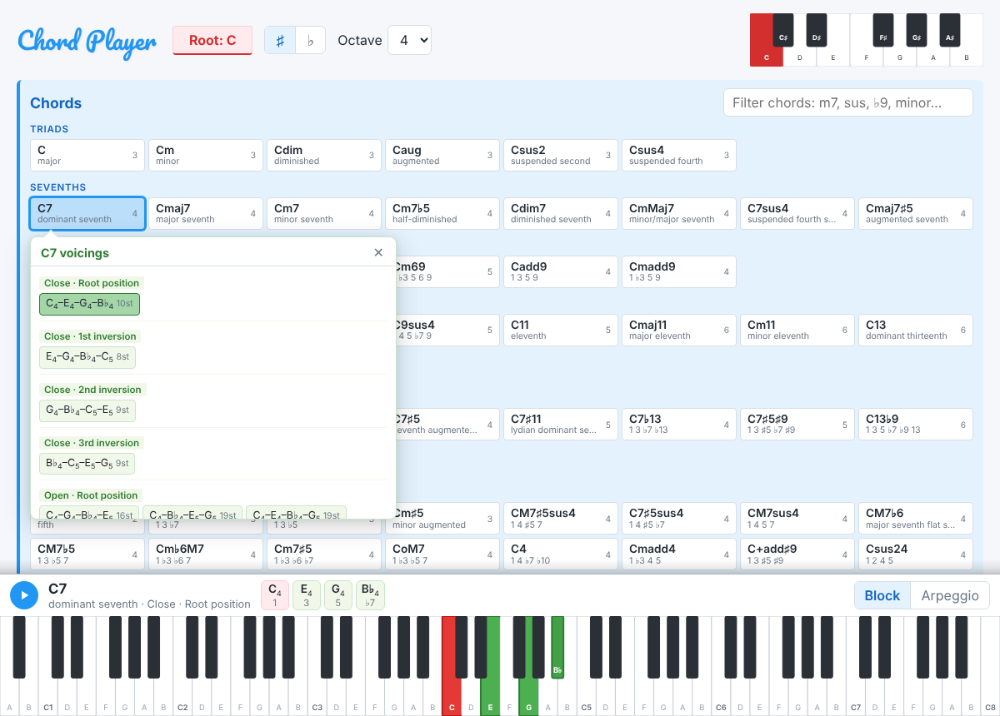
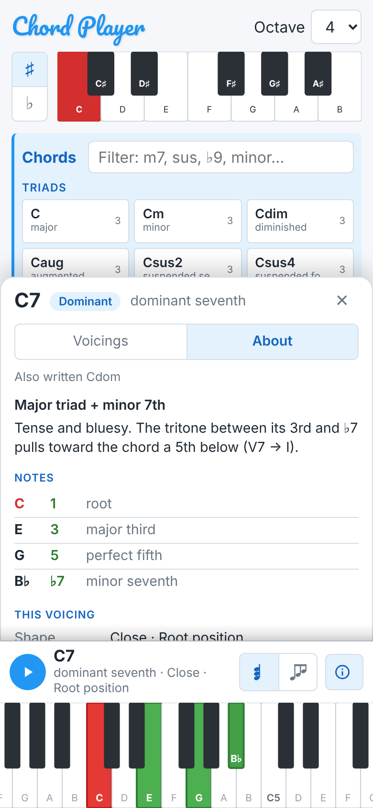

# 🎹 Chord Player

An interactive web app for exploring chord structures, voicings, and inversions — played on a sampled grand piano right in your browser.



<p align="center"></p>

## Features

- **Root selection** via a compact piano keyboard (click it, or Tab to it and use the arrow keys).
- **Sharps or flats** — a ♯/♭ toggle respells black-key roots, so you get B♭ D F instead of A♯ C♯♯ E♯.
- **Every chord type from Tonal.js** (107 of them), grouped under headings: triads → sevenths → sixths & added tones → extended → altered dominants → everything else.
- **Chord filter** — type `m7`, `sus`, `♭9` (or `b9`), `minor`… to narrow the list.
- **Voicings & inversions** — close and open position voicings grouped by inversion in a popup next to the chord; click any of them to hear it.
- **Correct spelling everywhere** — notes are shown as they're spelled in the chord (C7 shows B♭, not A♯), with ♯/♭ symbols and scale degrees.
- **Now-playing bar** — the chord's name, the voicing, and each note with its degree (1 3 5 ♭7), plus a replay button.
- **Chord info panel** — whenever a chord plays, a panel explains it:
  - what kind of chord it is, how it's built ("major triad + minor 7th") and what it sounds like or is used for;
  - each note with its degree and interval name ("B♭ · ♭7 · minor seventh"), plus other ways to write the chord;
  - the voicing being played: inversion, bass note and slash-chord name (C7/E), figured bass (6/5), span and the steps between the notes;
  - the major and minor keys it belongs to, as Roman numerals (V7 in F, vii°7 in C♯ harmonic minor…);
  - scales that fit over it (C Mixolydian, C Lydian dominant…).

  It's a sidebar on wide screens, and the About tab of the chord sheet on phones and tablets.
- **Block or arpeggio** playback.
- **Playable 88-key keyboard** fixed at the bottom: highlights the sounding notes (root in red), labels them, scrolls to them, and plays notes when you click, drag across or tap the keys.
- **Smart pitch clamping** — voicings are moved down whole octaves until they sit at or below C7, so high inversions of extended chords don't get shrill.
- **Made for phones too** — tapping a chord opens one sheet above the piano with **Voicings** and **About** tabs (a side panel in landscape), instead of popups. The header fits in two rows, buttons are finger-sized, piano keys get wider and scroll to whatever plays, and the layout keeps clear of the iPhone notch and home indicator.
- **7 languages** — English, Español, Français, Deutsch, Italiano, Português and Català, switchable from the 🌐 picker in the header. Everything is translated: controls, chord names, the chord info panel (interval names, recipes, descriptions, keys and scales) and the screen-reader labels (German even reads the root keys as Cis, Es, B and H). The first visit follows your browser's language. Note names stay as letters (C D E…), as in international chord symbols.
- **Remembers your settings** (root, ♯/♭, octave, play style, sheet tab, language) between visits.
- **Dark mode** that follows your system setting.
- **Loading progress** for the piano samples, with a clear message if they can't be loaded.

## Tech Stack

| Layer | Technology |
|-------|-----------|
| Structure | HTML5 |
| Styling | Vanilla CSS with custom properties (Google Fonts — Pacifico) |
| Logic | Vanilla JavaScript (no build step) |
| Audio | [Tone.js](https://tonejs.github.io/) 14.8 — Sampler with Salamander Grand Piano samples |
| Music Theory | [Tonal](https://github.com/tonaljs/tonal) 6.5 — note, chord, and interval utilities |
| Keyboards | Custom SVG components (root picker + 88-key piano) |

## Getting Started

### Prerequisites

Just a modern browser. Audio samples stream from the Tone.js-hosted Salamander set — no local files needed.

### Run Locally

Clone or download the repository and serve over any static HTTP server:

```bash
# Python
python -m http.server 8080

# Node
npx serve .
```

Then open `http://localhost:8080/` in your browser.

> [!TIP]
> You can also open `index.html` directly, but some browsers may block audio without an HTTP origin.

### Usage

1. Wait for the "Piano ready" message (chords can be browsed while it loads).
2. Pick a root note on the small keyboard (highlighted in red). Use ♯/♭ to choose how black-key roots are spelled.
3. Click a chord to hear it. Its voicings open in a popup next to it; click one to hear that voicing. The chord info panel explains whatever is playing.
   On phones and tablets, the voicings and the chord info share a sheet above the piano: switch between them with the **Voicings** / **About** tabs, and reopen the sheet with the ⓘ button.
4. Close the popup or sheet with ✕, <kbd>Esc</kbd>, or by clicking the chord again (on wide screens, clicking elsewhere works too). Clicking another chord switches straight to it.
5. Pick the interface language with the 🌐 button next to the octave selector.
6. Use the octave selector to shift the register, and **Block / Arpeggio** in the bottom bar to change how chords are played.
7. Play single notes on the big keyboard at the bottom; on a phone, swipe it sideways to scroll.

## Project Structure

```
index.html      Main page
styles.css      Styling, layout, dark mode
i18n.js         Interface languages: string tables for en, es, fr, de, it, pt, ca
theory.js       Music theory: chord catalogue, spelling, voicings, chord info (no DOM)
keyboard.js     SVG keyboard components: RootKeyboard and PianoKeyboard
script.js       App logic: UI wiring, voicing popup / sheet, chord info, audio, settings
LICENSE         GPLv3
```

## Keyboard Components

- **RootKeyboard** — one-octave layout (7 white + 5 black keys) used for root selection. Works as an accessible radio group (Tab, arrow keys, Home/End) and relabels its black keys for sharps or flats. Scales via CSS.
- **PianoKeyboard** — 88 keys (A0–C8) that fill the width of the window. Keys never get narrower than 18px (26px on phones, set by the `--piano-key-min` CSS variable); on smaller screens the keyboard scrolls instead and brings the sounding notes into view. Redraws itself when its width changes.

## Audio

Uses `Tone.Sampler` with a sparse sample map (A, C, D♯, F♯ across octaves) that Tone.js pitch-shifts in between. The samples are loaded one by one so the app can show progress, as Ogg (or MP3 where Ogg isn't supported, e.g. Safari). Release is set to 1 second. Browsers only allow audio to start after a user gesture, so the audio context is resumed on the first click, tap or key press.

## Development Notes

- **No build step** — edit files, refresh, done.
- `theory.js` has no DOM access and also exports itself via `module.exports`, so voicing logic can be tested in Node (load Tonal's browser build into `globalThis.Tonal`, and `i18n.js` into `globalThis.I18n`, first).
- **Translations** live in `i18n.js`, one table per language; `I18n.t(key, vars)` fills `{placeholders}`, and a few entries are functions where grammar needs it (ordinal inversions, interval names, German note names). Missing keys fall back to English. Static markup is translated through `data-i18n` / `data-i18n-attr` attributes. To add a language, copy the English table, translate it and add it to `LANGUAGES` and `STRINGS`.
- Chords are looked up with `Tonal.Chord.getChord(type, tonic)` rather than by joining strings, which Tonal can misread (for example "C" + "b9sus" parses as a C♭ chord).
- Voicing generation uses a MIDI-ceiling approach (`MIDI 96 = C7`) to keep inversions of extended chords in a comfortable range.
- Key membership (the "In keys" list) checks that every chord tone sits on its own scale degree, not just that the pitches are in the scale. That keeps symmetrical chords honest: C°7 shows up as vii°7 in C♯/D♭ harmonic minor, not as a chord on the 6th degree of E minor. Altered dominants (7♯9, 7alt) therefore belong to no key; the panel points to their scales instead.

## Potential Improvements

- Sustain pedal / envelope controls.
- MIDI input support (Web MIDI API).
- Export voicings as MusicXML or MIDI.
- Manual light/dark toggle (dark mode currently follows the system setting).
- Multi-note input on the keyboards, with chord detection.
- Chord progression sequencer.

## License

Distributed under the **GNU General Public License v3.0**. See [`LICENSE`](LICENSE) for full terms.

## Attribution

- Piano samples: [Salamander Grand Piano](https://sfzinstruments.github.io/pianos/salamander/) (via Tone.js CDN)
- Libraries: [Tone.js](https://tonejs.github.io/), [Tonal](https://github.com/tonaljs/tonal)

## Contributing

Pull requests are welcome. For larger changes (architecture or feature additions), open an issue first to discuss scope & approach.

---

Enjoy exploring chords and voicings! 🎹
